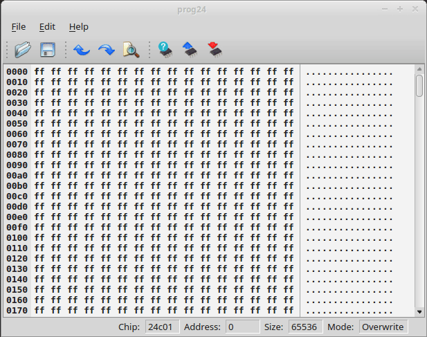

# I2C EEPROM programmer

The Prog24 is a free I2C EEPROM programmer tool for CH341A device based on [QhexEdit2](https://github.com/Simsys/qhexedit2) and
[ch341 c-programmer tools](https://github.com/command-tab/ch341eeprom).

This is a GUI program based on QhexEditor, which adds EEPROM read/write buttons and programmer information menu.

## Usage

1. Insert the EEPROM 24Cxx chip in the correct place in the socket of the programmer. See the picture on the PCB of the programmer for information.

2. Connect your CH341A Programmer device into usb port.

3. Select the EEPROM chip in menu - 24C01, 24C02 ...24C512 (Press button ).

4. For reading from a chip select the 'Read from EEPROM' item. (Press button ).

5. For saving the dump press the diskette button   and setting the name of file.

6. For open the existing file press the folder icon    and select the file.

7. For writing the dump to EEPROM press the 'Write to EEPROM'  button.
